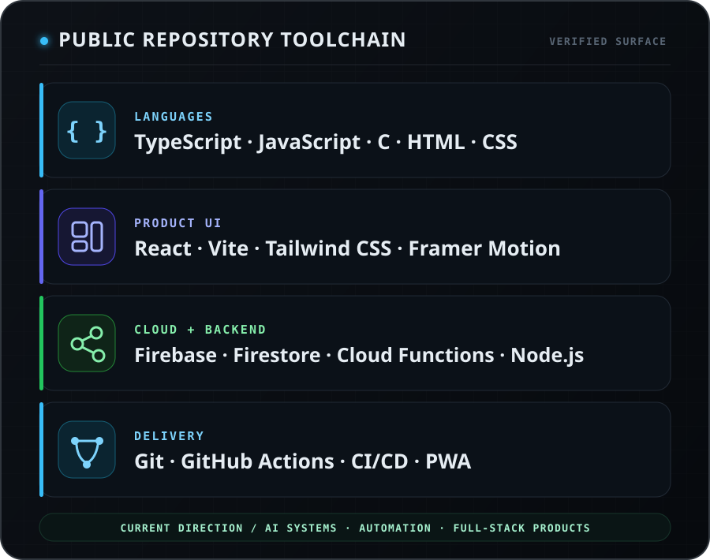
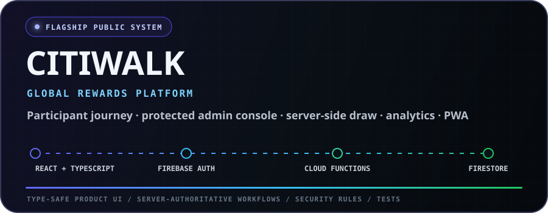
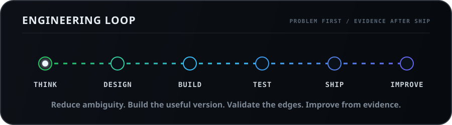
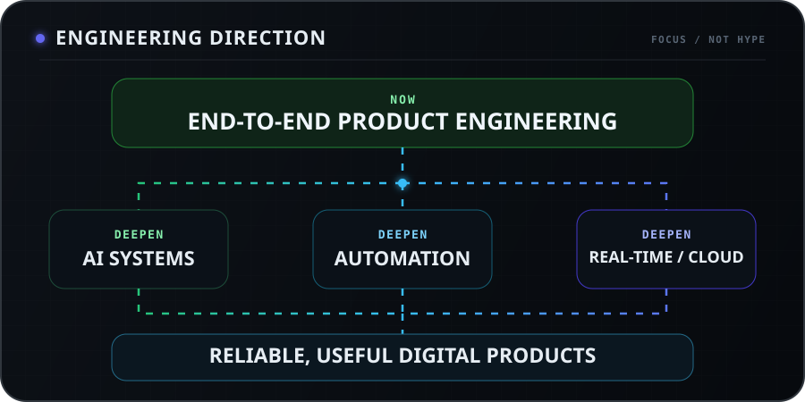

  

   

  <strong>I build software, AI-powered systems, automation, and real-world digital products.</strong>

    

  <a href="#user-content-selected-work"><strong>EXPLORE THE WORK</strong></a>
  &nbsp;·&nbsp;
  <a href="#user-content-currently-building"><strong>CURRENT BUILD</strong></a>
  &nbsp;·&nbsp;
  <a href="https://github.com/jinmelkunnath-alt?tab=repositories"><strong>ALL REPOSITORIES</strong></a>

    

  
    <a href="#user-content-identity">Identity</a> &nbsp;·&nbsp;
    <a href="#user-content-what-i-build">Build</a> &nbsp;·&nbsp;
    <a href="#user-content-stack">Stack</a> &nbsp;·&nbsp;
    <a href="#user-content-selected-work">Projects</a> &nbsp;·&nbsp;
    <a href="#user-content-engineering-mindset">Process</a> &nbsp;·&nbsp;
    <a href="#user-content-contributions">Contributions</a> &nbsp;·&nbsp;
    <a href="#user-content-roadmap">Roadmap</a> &nbsp;·&nbsp;
    <a href="#user-content-connect">Connect</a>
  

---

## 01 / IDENTITY

> **Software developer. Product-minded builder.** 
> I turn ideas into working systems—shaping the interface, data flow, automation, and delivery path instead of stopping at the mockup.

My public work spans **TypeScript/React products**, **Firebase-backed operational platforms**, **workflow automation**, and an **ANSI C developer tool**. My current direction extends that foundation into **AI-powered systems** and **Kalvi Chat**.

`CURRENT BUILD` **Kalvi Chat** &nbsp;·&nbsp; `CORE` **Software / AI / Automation** &nbsp;·&nbsp; `OUTPUT` **Useful digital products**

## 02 / WHAT I BUILD

### Product software

Interfaces and end-to-end flows built around an actual job: registration, operations, payments, reporting, rewards, or communication.

### Cloud-backed systems

Applications that connect product UI to authentication, data, server-side workflows, security rules, analytics, and deployment.

### Automation

Repeatable workflows—from reward and referral logic to CI/CD and operational status engines—that reduce manual steps and make systems easier to run.

### AI product direction

AI-powered product systems are an active focus. I keep this profile evidence-led: implementation claims appear only when the supporting source is public.

## 03 / ENGINEERING STACK

  

Stack shown from current public repositories and their manifests—not a speculative tool dump.

## 04 / SELECTED WORK

A curated view of the strongest public systems. The current build, **Kalvi Chat**, has its own product-status section below.

### 01 — CITIWALK Global Rewards

An enterprise giveaway platform with a public participant journey, protected administrator surface, server-authoritative registration and winner selection, analytics, exports, PWA support, security rules, tests, and deployment configuration.

`TYPESCRIPT` `REACT` `FIREBASE` `CLOUD FUNCTIONS` `VITE`

**Purpose** — run a full rewards campaign across participant and administrator workflows. 
**Status** — public codebase; production configuration is documented and deployment remains environment-dependent.

[**SOURCE →**](https://github.com/jinmelkunnath-alt/CITIWALK) &nbsp;·&nbsp; [**LIVE SITE →**](https://citiwalk.vercel.app)

<strong>Open the engineering surface</strong>

 

- Anonymous participant sessions and claim-gated administrator access
- Atomic Firestore reservation and server-generated entry numbers
- Callable Cloud Functions in `asia-south1`
- Server-side permanent winner draw, audit logs, analytics, CSV/XLSX exports
- App Check, restrictive security rules, validation, rate limits, CSP and PWA controls
- Type checking, unit checks, emulator flows, CI, architecture and deployment documentation

---

### 02 — [MarkForge](https://github.com/jinmelkunnath-alt/M2HTML) repository: `M2HTML`

`SYSTEMS TOOLING` `ALPHA` `OFFLINE-FIRST`

A Markdown processing toolkit built around a portable ANSI C core. The public alpha includes tokenization, a token stream, parser and AST, diagnostics, multiple renderers, a CLI, tests, build tooling, and a React/TypeScript website prototype.

**Purpose** — convert and inspect Markdown through a portable, testable processing pipeline. 
**Stack** — ANSI C · CMake/Make · TypeScript · React · Vite

[**SOURCE →**](https://github.com/jinmelkunnath-alt/M2HTML) &nbsp;·&nbsp; [**PLAYGROUND →**](https://jinmelkunnath-alt.github.io/M2HTML/)

---

### 03 — [Kalopsia](https://github.com/jinmelkunnath-alt/Kalopsia)

`OPERATIONS` `FIRESTORE` `REPORTING`

A data-centre operations manager for service entries, expense and recovery tracking, automatic payment status, analytics, reports, PDF/XLSX export, backup, and restore.

**Purpose** — move a recurring operational workflow from scattered records into one usable dashboard. 
**Stack** — HTML · CSS · JavaScript · Firebase Firestore · Chart.js

[**SOURCE →**](https://github.com/jinmelkunnath-alt/Kalopsia) &nbsp;·&nbsp; [**LIVE APP →**](https://jinmelkunnath-alt.github.io/Kalopsia/)

---

### 04 — [St.Annes-ICSE-School-Payment-Portal](https://github.com/jinmelkunnath-alt/St.Annes-ICSE-School-Payment-Portal)

`EDTECH WORKFLOW` `PAYMENTS` `ADMIN`

A multi-surface school fee portal with student access, fee dashboards, payment history, receipts, payment flows, and administrator tooling for student and fee management.

**Purpose** — make school fee information and payment operations easier to access and manage. 
**Stack** — HTML · CSS · JavaScript · Firebase · XLSX

[**SOURCE →**](https://github.com/jinmelkunnath-alt/St.Annes-ICSE-School-Payment-Portal) &nbsp;·&nbsp; [**LIVE PORTAL →**](https://st-annes-portal.vercel.app)

---

### 05 — [telegram-rewards-ecosystem](https://github.com/jinmelkunnath-alt/telegram-rewards-ecosystem)

`COMMUNITY SYSTEM` `REWARDS` `AUTOMATION`

A gamified rewards system for Telegram communities with registration and account states, referral flows, reward claims, ranks, a public leaderboard, and administrator surfaces.

**Purpose** — organize community growth and rewards into a single product workflow. 
**Stack** — React · JavaScript · Firebase · Vite · Framer Motion

[**SOURCE →**](https://github.com/jinmelkunnath-alt/telegram-rewards-ecosystem) &nbsp;·&nbsp; [**LIVE APP →**](https://jinmelkunnath-alt.github.io/telegram-rewards-ecosystem/)

---

### 06 — [school-voting-system](https://github.com/jinmelkunnath-alt/school-voting-system)

`EDUCATION` `RESPONSIVE UI` `LOCAL WORKFLOW`

A single-page student-leader voting experience with candidate voting, locally persisted counts, password-gated result and administration views, NOTA support, and responsive presentation.

**Purpose** — provide a focused digital voting flow for a classroom environment. 
**Stack** — HTML · CSS · JavaScript · Web Storage

[**SOURCE →**](https://github.com/jinmelkunnath-alt/school-voting-system) &nbsp;·&nbsp; [**LIVE APP →**](https://jinmelkunnath-alt.github.io/school-voting-system/)

<strong>More public operational work</strong>

 

**[kalopsia-paliative](https://github.com/jinmelkunnath-alt/kalopsia-paliative)** — a Firebase-backed service management system covering staff, clients, declaration generation/history, equipment inventory, and rental transactions. 
[Source](https://github.com/jinmelkunnath-alt/kalopsia-paliative) · [Live app](https://jinmelkunnath-alt.github.io/kalopsia-paliative/)

## 05 / CURRENTLY BUILDING

  

**Kalvi Chat** is the active product focus: a modern communication experience being shaped as a real product rather than a decorative chat mockup.

<strong>Build visibility</strong>

 

No repository named `Kalvichat` or `Kalvi Chat` is currently visible on this public account. This profile therefore does **not** link a nonexistent repository or advertise unverified features. Technical scope can be added here when source or product documentation becomes public.

[**FOLLOW THE PUBLIC BUILD LOG →**](https://github.com/jinmelkunnath-alt?tab=repositories)

## 06 / ENGINEERING MINDSET

  

<strong>01 — How I approach a project</strong>

 

1. Clarify the problem, user, constraints, and definition of done.
2. Map the product flow and data boundaries before adding visual noise.
3. Build the smallest honest version that completes the workflow.
4. Test edge cases, failure states, responsiveness, and deployment assumptions.
5. Ship, observe, document, and improve from evidence.

<strong>02 — What I am deepening</strong>

 

- Software architecture and production-minded full-stack development
- AI-powered product systems
- Automation and API workflows
- Real-time systems and cloud engineering
- UI/UX craft, accessibility, and product delivery

<strong>03 — The quality bar</strong>

 

Useful before impressive. Clear before clever. Maintainable before over-engineered. A product is not finished when the screen looks complete—it is finished when the workflow holds together.

## 07 / CONTRIBUTION JOURNEY

<picture>
  <source media="(prefers-color-scheme: dark)" srcset="assets/github-snake-dark.svg" />
  <source media="(prefers-color-scheme: light)" srcset="assets/github-snake.svg" />
  
</picture>

Repository-hosted SVGs · light and dark variants · refreshed daily by a pinned GitHub Actions workflow · manual dispatch supported

[**VIEW THE GENERATOR WORKFLOW →**](.github/workflows/snake.yml)

## 08 / GITHUB ACTIVITY

> **No vanity counters. No fragile stat cards.** 
> The native GitHub activity graph and the repositories themselves remain the source of truth.

[**OPEN LIVE ACTIVITY →**](https://github.com/jinmelkunnath-alt?tab=overview) &nbsp;·&nbsp; [**BROWSE PUBLIC REPOSITORIES →**](https://github.com/jinmelkunnath-alt?tab=repositories)

## 09 / ROADMAP

  

The direction is deliberate: strengthen the engineering foundation, deepen AI and automation, and keep turning those capabilities into products people can actually use.

## 10 / CONNECT

### Have a product idea or a real workflow that needs better software?

Start with the work. Follow the build. See how the systems are put together.

 

[**EXPLORE ALL REPOSITORIES →**](https://github.com/jinmelkunnath-alt?tab=repositories)
&nbsp;&nbsp;·&nbsp;&nbsp;
[**FOLLOW ON GITHUB →**](https://github.com/jinmelkunnath-alt)

  

<!-- Add only verified portfolio, LinkedIn, or email links here when they become publicly available. -->
